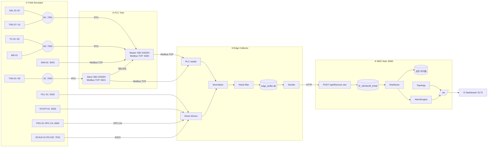
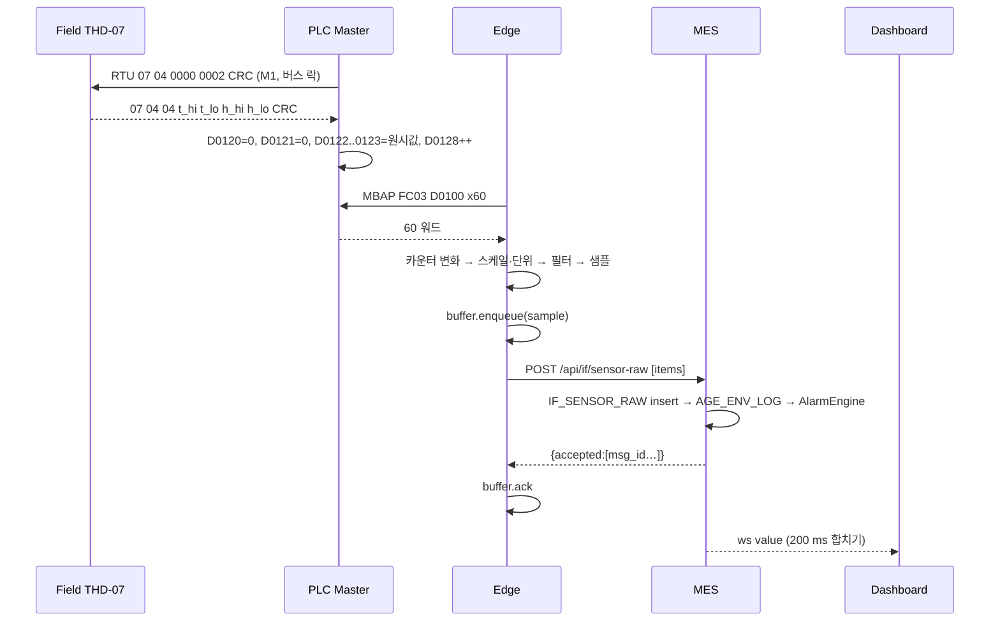
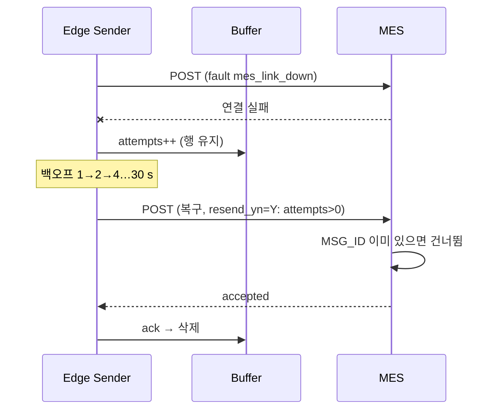
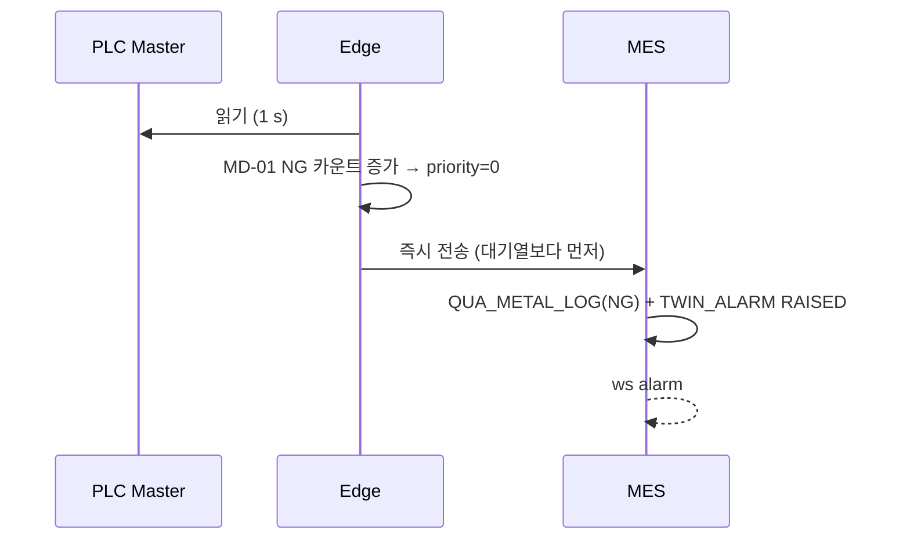

# ARCHITECTURE — 임진강김치 PLC 데이터수집 디지털 트윈 v0.1

## 1. 구성도

모든 계층은 한 프로세스(`twin.supervisor`)의 asyncio 루프에서 돈다. 계층 사이는 127.0.0.1 소켓으로만 통신한다(D-003).

## 2. 시퀀스

### 2.1 정상 수집 (THD-07)

### 2.2 MES 장애와 재전송

### 2.3 금속검출 NG

## 3. 모듈 인터페이스

| 모듈 | 주요 API |
|---|---|
| `common/config.py` | `load_config(dir, overrides) -> TwinConfig` (pydantic 검증, 맵 검증) |
| `common/modbus.py` | `crc16(b)`, `rtu_request(unit, fc, addr, count)`, `parse_rtu_response(...)`, `mbap_*`, `ModbusError` |
| `common/clock.py` | `Clock.now()`, `Clock.sim_dt(real_s)` |
| `field/models/*.py` | `DeviceModel.step(dt)`, `.registers() -> dict[str,int]`, `.read(fc, addr, count) -> list[int]` |
| `field/servers/rtu_bus.py` | `RtuBusServer(bus_id, devices, faults, baud)` |
| `field/servers/mbtcp.py` | `ModbusTcpDeviceServer(device, faults)` |
| `field/servers/opcua.py` | `TapingOpcUaServer(model, faults)` |
| `field/servers/scale.py` | `AsciiScaleServer(model, faults)` |
| `field/faults.py` | `FaultManager.add/remove/active()`, `device_fault(code)`, `is_active(type, target)` |
| `plc/link.py` | `SerialLink` 프로토콜, `TcpRtuLink`, `SerialPortLink` |
| `plc/memory.py` | `PlcMemory.write_block(base, words)`, `read(addr, count)` |
| `plc/bus_scanner.py` | `BusScanner.run()`, 장비별 `DeviceDiag` |
| `plc/server.py` | `PlcModbusServer` (FC03/04만, Write 거부 로그) |
| `plc/runtime.py` | `PlcRuntime(id)`: 스캐너·서버·하트비트·Slave 미러 |
| `edge/plc_reader.py` | `PlcReader.poll() -> list[Sample]` |
| `edge/drivers/*.py` | `EdgeDriver.run()` → `Sample` 콜백 |
| `edge/normalizer.py` | `Normalizer.to_items(equip, raw) -> list[RawItem]` |
| `edge/noise_filter.py` | `NoiseFilter.accept(equip, item, value) -> bool` |
| `edge/buffer.py` | `Buffer.enqueue(sample, priority)`, `next_batch(max_items)`, `ack(ids)`, `mark_failed(ids)`, `purge()` |
| `edge/sender.py` | `Sender.run()` |
| `mes/db.py` | 스키마 생성, 시드 |
| `mes/ingest.py` | `ingest(items) -> accepted` |
| `mes/distributor.py` | `Distributor.route(group)` |
| `mes/alarms.py` | `AlarmEngine.evaluate(equip, item, value, ts)`, `raise_comm/clear_comm` |
| `mes/topology.py` | `Topology.snapshot()` |
| `mes/ws_hub.py` | `WsHub.publish(msg)`, 합치기 flush |
| `mes/app.py` | FastAPI 라우터 (REST·WS·정적 파일) |
| `supervisor.py` | `Twin.start()/stop()`, 고장 반영(reconcile) |

## 4. 데이터 모델

`src/twin/mes/schema.sql`. 컬럼은 TD5 원문 철자를 따른다. SQLite에 맞춰 BIGSERIAL → INTEGER PRIMARY KEY, TIMESTAMP → ISO8601 TEXT, JSONB → TEXT로 옮긴다.

| 테이블 | 핵심 컬럼 |
|---|---|
| BAS_EQUIP | EQUIP_ID, EQUIP_CODE(UQ), EQUIP_NAME, EQUIP_TYPE, PROCESS_ID, PLC_TAG, COMM_TYPE, COLLECT_ITEM, USE_YN |
| BAS_CCP_STD | CCP_STD_ID, ITEM, EQUIP_CODE, LOW, HIGH, UNIT, HOLD_SEC, BASIS (트윈 단순화) |
| IF_SENSOR_RAW | RAW_ID, EQUIP_ID, TAG_ADDR, DATA_TYPE, RAW_VALUE, UNIT_CD, COMM_TYPE, TARGET_TABLE, RESEND_YN, COLLECT_DT, *MSG_ID(트윈, UQ)* |
| SLT_TANK_OPR | TANK_OPR_ID, EQUIP_ID, TANK_NO*, TARGET_SALINITY*, START_DT, TANK_STATUS |
| SLT_SALINITY_LOG | SALINITY_LOG_ID, TANK_OPR_ID, SENSOR_ID, SALINITY_VALUE, ELAPSED_HOURS, ALARM_YN, COLLECT_TYPE, MEASURE_DT |
| WSH_SANITIZER_LOG | SANITIZER_LOG_ID, EQUIP_ID, WORK_ORDER_ID, PPM_VALUE, CONTACT_TIME, DOSING_RATE, ALARM_YN, COLLECT_DT |
| AGE_ENV_LOG | ENV_LOG_ID, EQUIP_ID, SENSOR_ID, TEMP_VALUE, HUMID_VALUE, SET_TEMP, COMM_TYPE, COLLECT_DT |
| AGE_ENV_ALARM | ENV_ALARM_ID, ENV_LOG_ID, CCP_STD_ID, ALARM_ITEM, ALARM_VALUE, CONFIRM_YN, ACTION_DESC, ALARM_DT |
| QUA_METAL_LOG | METAL_LOG_ID, EQUIP_ID, WORK_ORDER_ID, LOT_NO, DETECT_RESULT, INSPECT_QTY, NG_QTY, ALARM_YN, COLLECT_DT |
| PKG_TAPING_LOG | TAPING_LOG_ID, EQUIP_ID, WORK_ORDER_ID, PACK_QTY, RUN_STATUS, RUN_MINUTES, COLLECT_TYPE, COLLECT_DT |
| PKG_WEIGHT_INSP | WEIGHT_INSP_ID, WORK_ORDER_ID, ITEM_ID, STD_WEIGHT, MEASURE_WEIGHT, GAP_WEIGHT, JUDGE_RESULT, INSPECT_DT |
| MIX_FILLER_LOG | FILLER_LOG_ID, EQUIP_ID, WORK_ORDER_ID, BATCH_NO, WORK_SPEED, SET_VOLUME, SETTING_JSON, COLLECT_TYPE, COLLECT_DT |
| EQP_RUN_LOG | RUN_LOG_ID, EQUIP_ID, RUN_STATUS, STOP_CODE, START_DT, END_DT, STOP_MINUTES, INPUT_TYPE |
| TWIN_ALARM | ALARM_ID, CATEGORY, ITEM, EQUIP_CODE, SEVERITY, MESSAGE, VALUE, STATE, RAISED_DT, ACKED_DT, CLEARED_DT (D-006) |

`*` 표시는 트윈 전용 보조 컬럼이다. 더미 FK: ORD_WORK_ORDER 1행(WORK_ORDER_ID=1), LOT_NO `L260921-01`, ITEM_ID 1.

## 5. 설정 스키마 (pydantic 요약)

| 파일 | 모델 |
|---|---|
| runtime.yaml | `Runtime{seed, time_scale, host, ports{…}, edge{id, plc_poll_ms, batch_max, retention_hours, backoff_max_s, stale_factor}, ws{flush_ms}, data_dir, log_level}` |
| equipment.yaml | `Equipment{plcs{MASTER,SLAVE}, buses{id: plc, link, baud, timeout_ms, retries}, equipment[{code, name, process, type, via{bus,slave}|{plc_tcp,link,unit}|{edge,link}, plc_block?, poll_ms, delay_ms, target, items[{name, reg|node, type, scale, unit, data_type, column, range, max_step}], sim{model,…}, assumed[]}]}` |
| plc_map.yaml | `PlcMap{block_words:10, diag_base:900, blocks{MASTER{code: addr}, SLAVE{…}}}` |
| ccp_std.yaml | `[CcpRule{id, item, equip[], low?, high?, band?, unit, hold_sec, basis, severity}]` |
| scenarios.yaml | `{name: [{target, type, params, duration_s, at_s}]}` |

검증: 블록 겹침, 한 블록 10워드 초과(+2~+7 값 6워드), 설비 코드 중복, PLC 경유 장비의 블록 누락·중복 매핑, 버스 slave id 중복. 오류는 `config: equipment.yaml equipment[3].items[1].reg: …` 형식 한 줄로 알린다.

## 6. 상태 판정

| 대상 | OK | DELAY | DOWN | ERROR | STALE |
|---|---|---|---|---|---|
| PLC 경유 장비 | 최근 폴 성공 | 최근 5회 평균 응답 > delay_ms (D-008) | 연속 3회 실패 | 최근 1분 CRC·예외·프레임 오류 비율 > 10 % | Edge가 본 갱신카운터가 poll_ms × 3 동안 불변, 또는 PLC 불통 |
| 직결 장비 (Edge) | 〃 | 〃 | 연속 3회 실패 / OPC-UA 끊김 | 프레임 오류 비율 > 10 % | — |
| 버스 | 모든 장비 OK | 일부 DELAY | 모든 장비 DOWN | 일부 DOWN/ERROR | — |
| PLC | Edge 읽기 성공 + D0900 증가 | — | 읽기 실패 또는 D0900 3 s 불변 | — | — |
| Master–Slave | D0902 증가 | — | D0902 3 s 불변 | — | — |
| Edge–MES | 마지막 전송 성공 | — | 마지막 전송 실패 | — | — |

장비 상태 코드(D영역 +0): 0 OK, 1 DELAY, 2 DOWN, 3 ERROR. 첫 성공 전에는 2다.

## 7. 시간 모델

- 벽시계 기반 실시간. 모든 시각은 KST ISO8601(`+09:00`).
- `runtime.time_scale`은 공정 모델의 dt에만 곱한다(염도 감소, 절임 경과시간). 통신 주기·타임아웃·알람 지속시간은 실시간이다(D-004).
- 공정 모델은 1 s 틱으로 갱신하고, 장비별 난수 생성기는 `seed + crc32(code)`로 초기화한다. 같은 틱 수면 같은 시퀀스가 나온다(AC-14).
